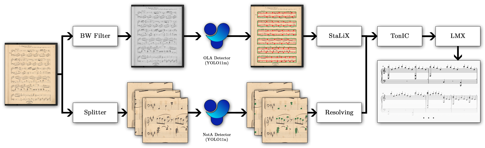

# Tone Identification and Classification (TonIC)

TonIC is an algorithm for converting raw object detections of grand staff, measures and noteheads into structured MusicXML representations.
It is modular and individual components
can be independently modified or improved for experimental purposes.

## Pipeline visualization



The input image is passed through two object detection pipelines. First, it is run through a BW filter and the OLA model responsible for measure and grand staff detections. 
Measure detections are then refined using the StaLiX library. Second, the input image is divided into smaller tiles, which are individually processed by the NotA model for
notehead detection; the results are then stitched back together into a full-page. Finally, the combined detections are given to TonIC that outputs LMX, that is subsequently
converted into MusicXML.

## Additions to Existing Datasets

- [**MUSCIMA#**](datasetup/MuscimaSharp/README.md)
    - Combination of annotations from MUSCIMA++, sheet music from CVC-MUSCIMA, and 162 distinct empty backgrounds from MZKBlank.
- [**MuNG to OLA**](datasetup/mung2ola/README.md)
    - Algorithm based on heuristics to create OLA objects - system measures, measures, staffs, system, grand staffs - from the original MuNG format.
- [**OLiMPiC Scanned**](datasetup/olimpic/README.md)
  - Downloads and unpacks the OLiMPiC Scanned dataset.

## After cloning

Setup Python venv (tested with Python 3.11):

```bash
python3 -m venv .venv
.venv/bin/pip install --upgrade pip

.venv/bin/pip install -r requirements.txt
```

Clone [Object Detection Tools](https://github.com/v-dvorak/od-tools) and [StaLiX](https://github.com/v-dvorak/stalix) and install them to venv:

```bash
# install StaLiX
cd <path>/stalix
.venv/bin/pip install -e .[viz]

# install od-tools
cd <path>/od-tools
.venv/bin/pip install -e .
```

## Running demo

If run for the first time, the `--update` argument should be present - latest detection models will be downloaded. Input image or directory can be specified with `-i <my-image.png>`, output directory can be specified with `-o <my-output-dir>`. If no images are specified, preselected examples from MZK will be downloaded and passed through the pipeline. For algorithm visualization use `--visualize <viz-level>`.

```bash
# minimal inference run with example images
python3 -m demo --update --visualize 2
```

## Running evaluation

For object detection $F_1$ score refer to the [Object Detection Tools](https://github.com/v-dvorak/od-tools) project.

Evaluation is run for two MusicXML files, their edit  distance in computed for four different formats: Standardized, Reduced, Melody, Contour; see [Format Overview](docs/format-overview.md) for reference.

```bash
python3 -m tonic.SERVal <predicted-file-or-dir> <gold-file-or-dir>
```

During OLiMPiC evaluation, raw images are passed through the pipeline and predictions are compared to loaded ground truth. The user can specify how many images should be processed:

```bash
# random 200 samples from OLiMPiC will be processed
python3 -m tonic.SERVal.tonic -c 200
```

## Known limitations

**Visualizations are not optimized**.
Methods responsible for visualization are debug helper functions and should not be used in large scale scenarios.

## References

### Muscima++, CVC-Muscima

> Jan Hajič jr., Pavel Pecina. In Search of a Dataset for Handwritten Optical Music Recognition: Introducing MUSCIMA++. CoRR, arXiv:1703.04824, 2017. [https://arxiv.org/abs/1703.04824](https://arxiv.org/abs/1703.04824).

> Alicia Fornés, Anjan Dutta, Albert Gordo, Josep Lladós. CVC-MUSCIMA: A Ground-truth of Handwritten Music Score Images for Writer Identification and Staff Removal. International Journal on Document Analysis and Recognition, Volume 15, Issue 3, pp 243-251, 2012. [DOI](https://doi.org/10.1007/s10032-011-0168-2).

### LMX, OLiMPiC

> Jiří Mayer, Milan Straka, Jan Hajič jr., Pavel Pecina. Practical End-to-End Optical Music Recognition for Pianoform Music. 18th International Conference on Document Analysis and Recognition, ICDAR 2024. Athens, Greece, August 30 - September 4, pp. 55-73, 2024.
[DOI](https://doi.org/10.1007/978-3-031-70552-6_4),
[GitHub](https://github.com/ufal/olimpic-icdar24).

> Mark Gotham, Robert Haigh, Petr Jonas. The OpenScore Lieder Corpus. Music Encoding Conference. Online, July 19-22, pp. 131-136, 2022. DOI: https://doi.org/10.17613/1my2-dm23, GitHub: https://github.com/OpenScore/Lieder


### OMR Layout Analysis (OLA)

> Vojtěch Dvořák, Jan jr. Hajič, and Jiří Mayer. Staff Layout Analysis Using the YOLO Platform. In Jorge Calvo-Zaragoza, Alexander Pacha, and Elona Shatri, editors, Proceedings of the 6th International Workshop on Reading Music Systems, pages 18-22, Online, 2024. [https://arxiv.org/abs/2411.15741](https://arxiv.org/abs/2411.15741).

## Contact


Developed and maintained by [Vojtěch Dvořák](https://github.com/v-dvorak) ([dvorak@ufal.mff.cuni.cz](mailto:dvorak@ufal.mff.cuni.cz)) as part of the [Prague Music Computing Group](https://ufal.mff.cuni.cz/pmcg) lead by [Jan Hajič jr.](https://ufal.mff.cuni.cz/jan-hajic-jr) ([hajicj@ufal.mff.cuni.cz](mailto:hajicj@ufal.mff.cuni.cz)).
