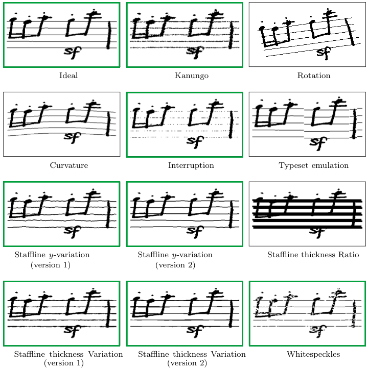

# MUSCIMA#

MUSCIMA# is a combination of annotations from MUSCIMA++, sheet music from CVC-MUSCIMA, and 162 distinct empty backgrounds from [MZKBlank](https://github.com/v-dvorak/omr-layout-analysis/tree/main/app/MZKBlank).


## Build the dataset

After cloning TonIC, set up a virtual environment and install requirements via pip:

```
pip install -r requirements.txt
```

And run the build script from the `tonic` directory:

```
python3 -m datasetup.MuscimaSharp
```

All the data necessary will be automatically downloaded.

## Chosen distortions

CVC-MUSCIMA includes a set of prerendered distortions. From these, the ideal version and seven distortions were selected. Other distortions, such as curvatures, rotations, and translations, were excluded due to potential annotation inconsistencies.



## References

### MUSCIMA++

> Jan Hajič jr., Pavel Pecina. In Search of a Dataset for Handwritten Optical Music Recognition: Introducing MUSCIMA++. CoRR, arXiv:1703.04824, 2017. https://arxiv.org/abs/1703.04824.

### CVC-MUSCIMA

> Alicia Fornés, Anjan Dutta, Albert Gordo, Josep Lladós. CVC-MUSCIMA: A Ground-truth of Handwritten Music Score Images for Writer Identification and Staff Removal. International Journal on Document Analysis and Recognition, Volume 15, Issue 3, pp 243-251, 2012. (DOI: 10.1007/s10032-011-0168-2).