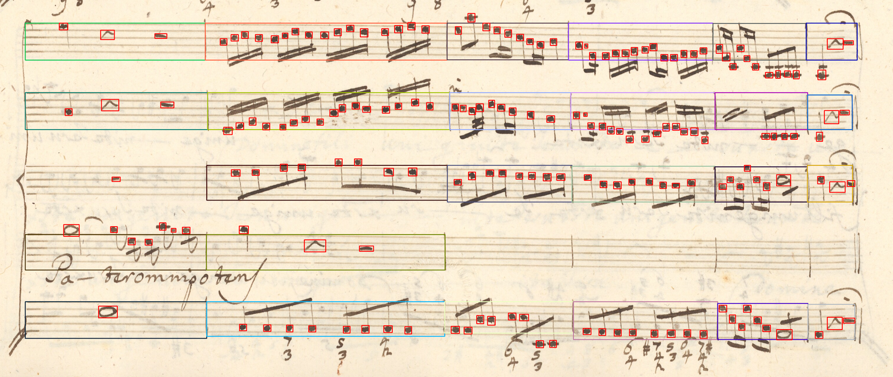
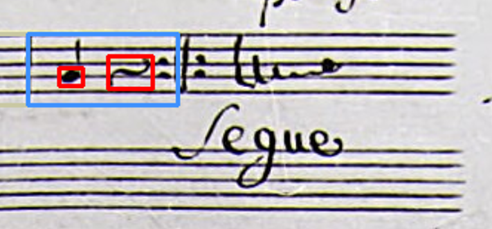
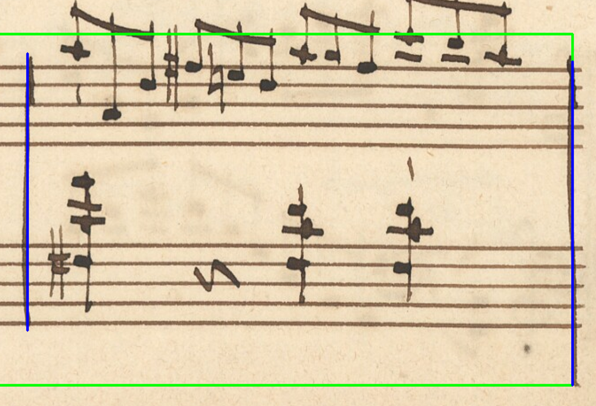
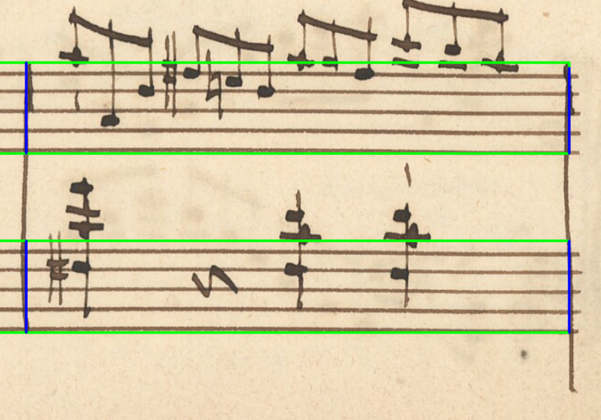
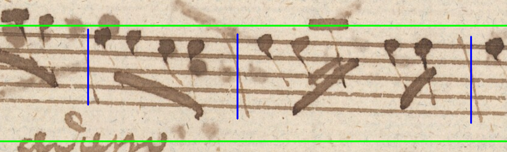
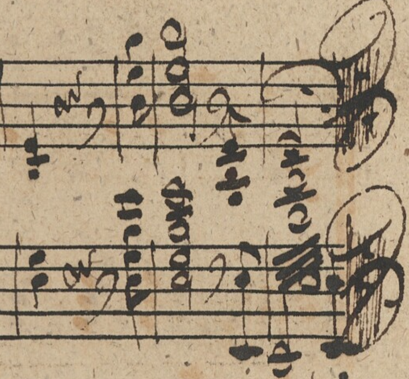
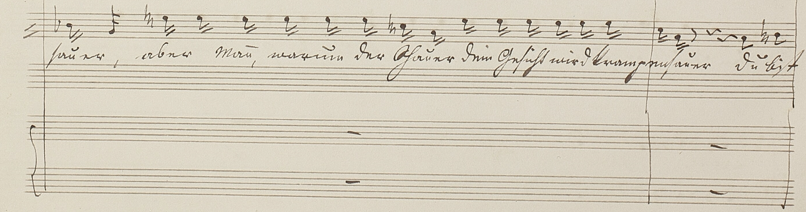

# MuNG to OLA Algorithm Description

## Simplifications

- vertically overlapping barlines belong to the same staff (system)
- system containing exactly two staffs is a grand staff
- two staffs connected by a staff grouping are a grand staff
- double barlines are merged into one
- symbols are assigned to the closest (system) measure
- system measure is valid if at least one `other_symbol` is assigned to it
- measure is valid if it is inside (bounded by threshold) any valid system measure
  - this greatly reduces false eliminations of measures
  - 
- repeat dots are not `other_symbol`, they can leak into artificially created measures that are empty
  - 
- on a single page of music there is only one column of staffs
  - this example is not a valid input as it contains two columns of staffs (left and right page)
  - 

## The algorithm

- retrieve staff lines, barlines, staff groupings and system separators
- remove duplicates in barlines and groupings

### Staffs

- sort staff lines from top to bottom and group them by 5

### System measures

- add possible "unannotated" system separators:
  - consider ends of systems as system separators
  - filter out systems separators that are too close to other separators
- create system measures from system separators:
  - sort them into rows
  - make bounding box from every two neighboring separators
- check if proposed system measures are correct:
  - if any symbol from `other_symbols` is assigned to concrete system measure than this system measure is valid and is kept

### Measures

- add possible "unannotated" barlines:
    - make groupings into barlines
    - consider ends of staffs as barlines
    - (for both of these, if other barline, retrieved beforehand, is close to the one we are trying to add, the original
      one is prioritized and kept)
- for all staffs find barlines that intersect them:
    - cut these barlines into smaller one, so that they fit the staffs
    - first example:
      - the last barline will be cut into two smaller ones and the overextended bit at the bottom will be thrown out
      - 
      - result:
      - 
    - second example:
      - in this case, the original barlines will be kept, as we try to minimize the difference between actual written
        barline and our annotation
      - 
- create measures from barlines:
  - sort them into rows
  - make bounding box from every two neighboring barlines
- check if proposed measures are correct:
  - if concrete measure is inside any valid system measure, it is valid and is kept

### Systems

- from every row of system separators choose the middle one, call them "spans"
  - this can prevent further complications when working with curved staff lines
- for every span find all staffs that intersect it and create a bounding box around them

### Grand Staffs

- create grand staff from every system containing exactly two staffs
- for every staff grouping check if it contains exactly two staffs, if yes, create a grand staff from them

## Why are any hardcoded values and assumptions a bad idea?

- unpredictable extremes
- visually really short measure
  - 
- visually really long measure
  - 

