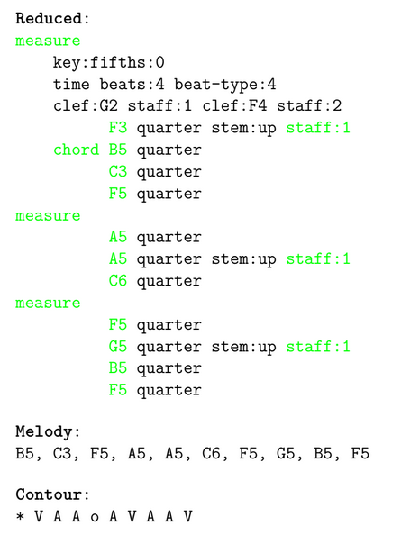

## Evaluation Formats

- **Standardized** is the minimal standard LMX output.
- **Reduced** filters out tokens that do not carry semantic information in our
setting and leaves only pitch, staff index and measure tokens.
- **Melody** displays only the highest-pitch note played at a time.
- **Contour** is Parsons Code generated from Melody.

Example of a score in LMX simplified to other formats. The original LMX (top) - **Standardized** - is converted to **Reduced** by keeping only the tokens highlighted in green. **Melody** (middle) is computed by taking the highest-pitch note of those playing at the same time, and from it **Contour** (bottom) is computed based on pitch shifts.